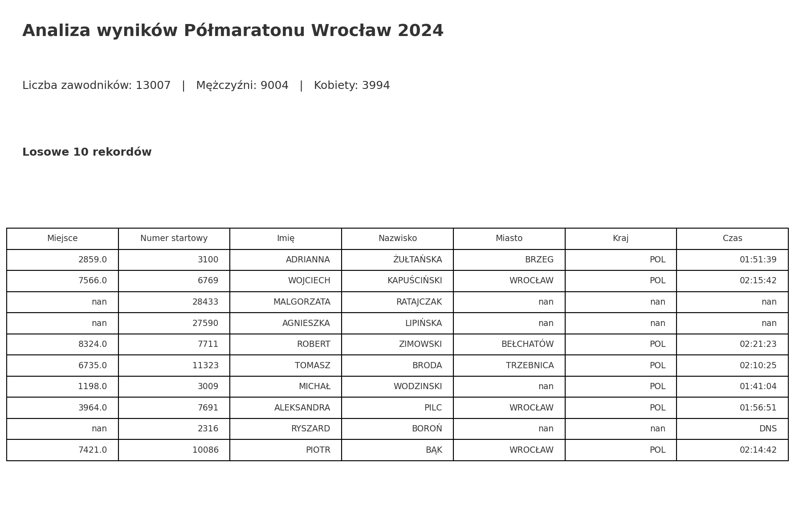
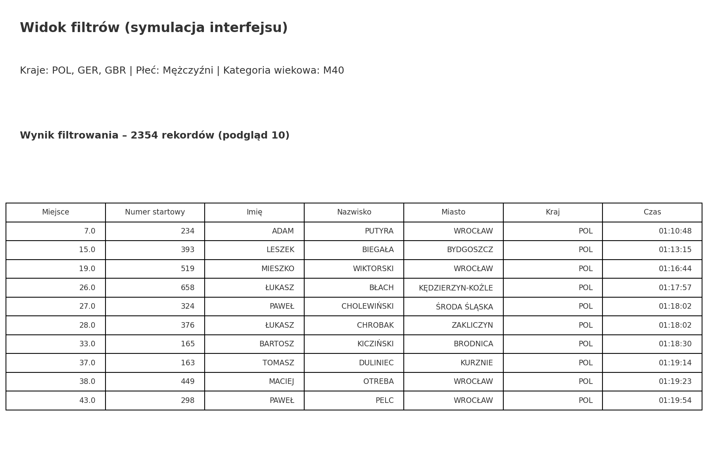
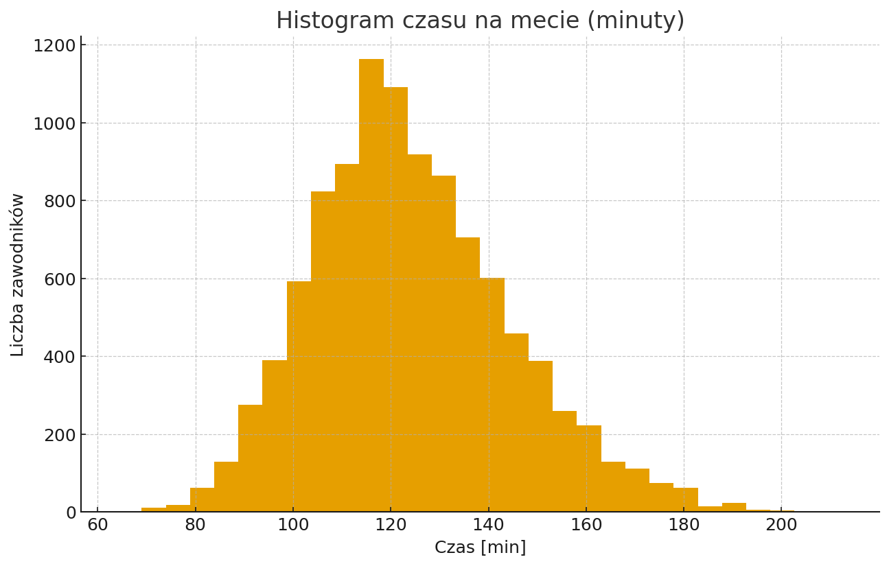

# 🏃 Analiza wyników Półmaratonu Wrocław 2024

**Autor:** Roman – *Aspiring Data Scientist & Python Streamlit Developer*

Interaktywna analiza wyników półmaratonu: filtry po kraju, płci i kategorii wiekowej, metryki, wykresy i TOP 5 zawodników.  
Dane są publiczne; aplikacja zbudowana w **Streamlit**.

[📥 Pobierz Notebook](halfmarathon_analysis_notebook.ipynb){ .md-button .md-button--primary }
[🔎 Zobacz podgląd HTML](halfmarathon_analysis_report.html){ .md-button }

## Podgląd







## Uruchomienie aplikacji lokalnie

```bash
pip install -r requirements.txt
streamlit run app.py
