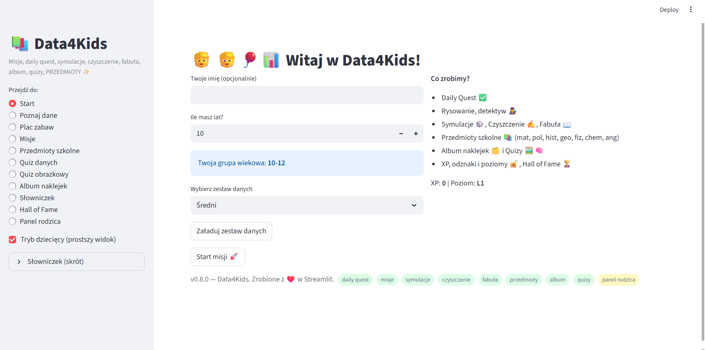
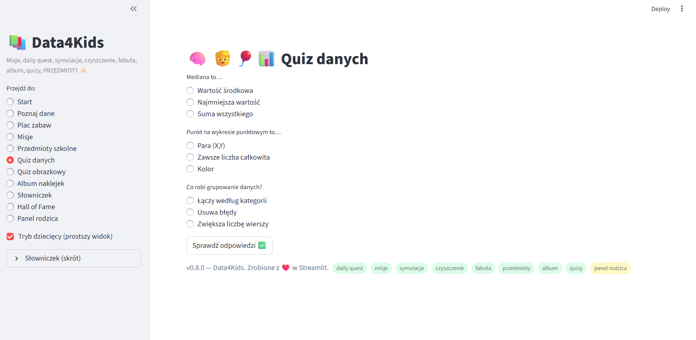
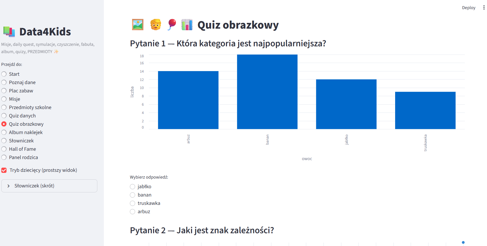

# 🧒📊 Data4Kids — Ucz się danych przez zabawę!

{ width="720" }

> **Data4Kids** to edukacyjna aplikacja w Pythonie (Streamlit) do nauki podstaw analizy danych poprzez gry, quizy, misje i fabułę.  
> Stworzona, by pokazać, że **dane mogą być przygodą!**

---

## 🎯 Cel projektu

Pomóc dzieciom (8–14 lat) zrozumieć pojęcia takie jak *średnia, mediana, grupowanie danych, wykresy* — ale **bez nudy**.  
Zamiast teorii – gra, punkty doświadczenia, naklejki i codzienne misje.

---

## 🧩 Główne funkcje

- 👦 Tryb dziecięcy i panel rodzica  
- 🧠 Quizy danych i quizy obrazkowe  
- 🧹 Misje: czyszczenie, sortowanie i eksploracja danych  
- 🎨 Album naklejek i fabularne „Daily Questy”  
- 🏫 Przedmioty szkolne: matematyka, polski, historia, geografia, fizyka, chemia, angielski  
- 🏅 System XP, poziomy i **Hall of Fame**

---

## 🚀 Demo aplikacji

[🌐 Uruchom demo Streamlit →](http://109.207.146.146:8501){ target=_blank }

> Wersja: **v0.8.0**  
> Zrobione z ❤️ w **Streamlit**.

---

## 🧭 Struktura aplikacji

| Moduł | Opis |
|-------|------|
| `app.py` | Główna aplikacja Streamlit |
| `config.toml` | Konfiguracja misji i quizów |
| `datasets/` | Zbiory danych dopasowane do wieku |
| `assets/` | Ikony, obrazki, naklejki |
| `components/` | Widoki Streamlit i quizy tematyczne |

---

## 📊 Podgląd aplikacji

### 👋 Ekran powitalny

{ width="700" }

Użytkownik wybiera imię, wiek i poziom trudności zestawu danych. System automatycznie dobiera **grupę wiekową** (np. 10–12).

---

### 🧠 Quiz danych

{ width="700" }

Krótki quiz, który uczy pojęć takich jak mediana, grupowanie, korelacja.  
Wyniki od razu się pokazują, a każdy poprawny wybór to punkty XP!

---

### 📸 Quiz obrazkowy

{ width="700" }

Uczniowie wybierają odpowiedź na podstawie wykresów i obrazków — bez tabelek!  
Świetny sposób na wizualne myślenie i logiczne skojarzenia.

---

## 🧮 Technologie

| Technologia | Zastosowanie |
|--------------|--------------|
| **Python** | logika aplikacji |
| **Streamlit** | interfejs użytkownika |
| **Pandas, Matplotlib** | przetwarzanie i wizualizacja danych |
| **MkDocs Material** | dokumentacja i portfolio projektu |

---

## 🧩 Roadmapa (w trakcie)

- [x] Tryb dziecięcy  
- [x] Quiz danych i quiz obrazkowy  
- [x] System XP i poziomy  
- [ ] Tryb fabularny z misjami  
- [ ] Statystyki postępów  
- [ ] Personalizacja postaci 👦👧  
- [ ] Tryb offline + eksport do PDF  

---

## 🧑‍🏫 Dlaczego to ważne?

Data4Kids łączy **dydaktykę z interaktywną zabawą**.  
Projekt pomaga dzieciom rozwijać:
- logiczne myślenie,  
- podstawy analizy danych,  
- cyfrową samoświadomość (świadome korzystanie z danych).  

---

## 🔗 Linki

- 🧮 [Demo Streamlit](http://109.207.146.146:8501){ target=_blank }  
- 💬 [Kontakt / LinkedIn](https://www.linkedin.com/in/twoj-linkedin/){ target=_blank }

---

*Data4Kids – bo dane też mogą mieć uśmiech 😊*
