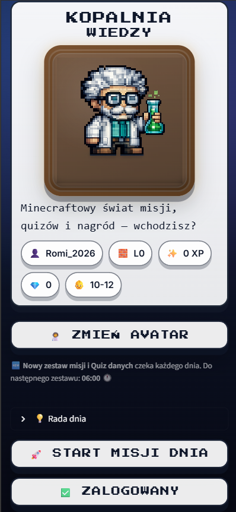
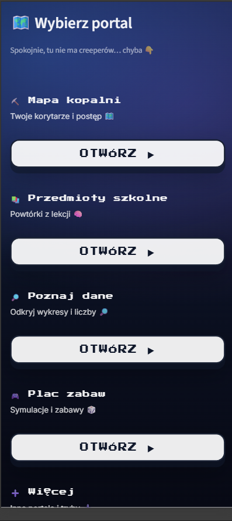
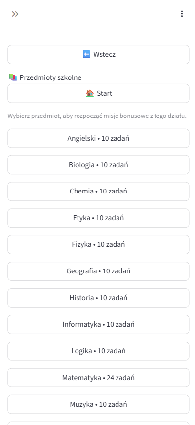

# 🧠📚 Kopalnia Wiedzy — Learn Through Play

{ width="420" }

> **Kopalnia Wiedzy** to edukacyjna aplikacja webowa zbudowana w Pythonie i Streamlit.
> Łączy naukę, quizy, misje, nagrody i elementy gry, żeby pokazać dzieciom, że nauka może być angażująca i przyjemna.
>
> **Kopalnia Wiedzy** is an educational web app built with Python and Streamlit.
> It combines learning, quizzes, missions, rewards and game-like mechanics to make knowledge more engaging for children.

---

## 🎯 Cel projektu / Project Goal

Projekt powstał po to, aby zamienić naukę w interaktywną przygodę.
Zamiast suchej teorii użytkownik przechodzi przez kolejne aktywności, zdobywa XP, odblokowuje elementy i rozwija się krok po kroku.

The goal of the project is to turn learning into an interactive adventure.
Instead of passive content, the user progresses through activities, earns XP and unlocks new elements over time.

---

## 🧩 Aktualne funkcje / Current Features

- 👦 Gra jako zalogowany użytkownik lub Gość
- 🧑‍🎨 Wybór i zmiana avatara
- 🧠 Quiz danych
- 🖼️ Quiz obrazkowy
- 🎯 Misje i codzienne aktywności
- 🎁 Skrzynka z nagrodami
- 🏆 Hall of Fame
- 📘 Słowniczek
- 🗺️ Mapa kopalni
- ⚡ Wyzwanie dnia
- 📚 Pomoce szkolne
- 📖 Lektury i streszczenia
- 🚲 Karta rowerowa: nauka, testy i egzamin próbny
- 🎨 Album naklejek
- 🕹️ Plac zabaw i dodatkowe aktywności
- 🔐 Panel nadzoru

---

## 🚀 Demo aplikacji / Live Demo

[🌐 Uruchom aplikację / Open live demo](https://kopalniawiedzy-wioy8.ondigitalocean.app/){ target=_blank }

> Wdrożenie: **DigitalOcean App Platform**  
> Zbudowano w oparciu o **Python** i **Streamlit**

---

## 🧱 Architektura / Architecture

Aktualna wersja projektu ma bardziej modularną strukturę niż wcześniejsze wydania.
Kod jest rozdzielony na warstwy odpowiedzialne za routing, logikę aplikacji, widoki i elementy interfejsu.

The current version uses a more modular structure than the earlier releases.
The codebase is organized into routing, core logic, views and UI components.

### Główne elementy repo / Main Repository Areas

- `app.py` — główny punkt startowy aplikacji
- `core/` — routing, stan aplikacji, motyw i logika pomocnicza
- `pages/` — widoki i moduły funkcjonalne
- `ui/` — elementy interfejsu
- `assets/` — zasoby graficzne i animacje
- `data/` — dane wykorzystywane przez moduły edukacyjne

---

## 📚 Moduły edukacyjne / Learning Modules

Aplikacja nie ogranicza się już tylko do prostych quizów.
Obecna wersja rozwija się w kierunku większego świata edukacyjnego z wieloma obszarami nauki i aktywności.

Current development goes beyond simple quizzes.
The app is evolving into a broader educational world with multiple learning areas and activity types.

### Przykładowe obszary / Example Areas

- **Quiz danych** — pytania rozwijające logiczne myślenie i rozumienie informacji
- **Quiz obrazkowy** — nauka przez obrazy i wizualne skojarzenia
- **Pomoce szkolne** — sekcja wspierająca naukę
- **Lektury** — powtórki, postacie, motywy i streszczenia
- **Karta rowerowa** — teoria, testy i egzamin próbny
- **Wyzwanie dnia** — krótkie codzienne zadanie
- **Album naklejek / Hall of Fame** — motywacja i postęp użytkownika

---

## 👨‍👩‍👧 Tryb użytkownika i nadzór / User Mode and Supervision

Projekt zawiera zarówno elementy zabawy, jak i funkcje kontroli.
Po stronie użytkownika ważne są postęp, nagrody i personalizacja, a po stronie nadzoru — zarządzanie i bezpieczeństwo dostępu.

The project combines playful learning with supervision features.
On the user side it focuses on progress, rewards and personalization; on the admin side it includes management and access control.

---

## 📊 Co pokazuje ten projekt / What This Project Demonstrates

Ten projekt pokazuje moje praktyczne umiejętności w zakresie:

- budowy większej aplikacji webowej w Pythonie
- pracy z modularną architekturą
- projektowania logiki produktu edukacyjnego
- rozwijania nawigacji i wielu ekranów w Streamlit
- łączenia gamifikacji z funkcjami użytkowymi
- iteracyjnego rozwijania produktu od MVP do bogatszej wersji

This project demonstrates my practical skills in:

- building larger Python web applications
- working with a modular architecture
- designing educational product logic
- developing multi-screen Streamlit navigation
- combining gamification with utility features
- iterating from MVP to a richer product version

---

## 📸 Podgląd aplikacji / App Preview

### 👋 Ekran startowy / Home Screen

{ width="420" }

Aktualny ekran startowy pokazuje profil gracza, poziom, XP, przyciski wejścia do misji oraz szybki dostęp do kluczowych funkcji aplikacji.

---

### 🗺️ Wybór portalu / Portal Selection

{ width="420" }

Użytkownik może przechodzić między głównymi obszarami aplikacji, takimi jak mapa kopalni, przedmioty szkolne, poznawanie danych i plac zabaw.

---

### 📚 Przedmioty szkolne / School Subjects

{ width="420" }

Sekcja przedmiotów szkolnych prowadzi do zestawów zadań bonusowych z różnych dziedzin, takich jak matematyka, geografia, historia, fizyka czy informatyka.

---

## 🧮 Technologie / Tech Stack

- **Python**
- **Streamlit**
- **Pandas**
- **Matplotlib**
- **MkDocs Material**
- modularna organizacja kodu oparta na `core/`, `pages/` i `ui/`

---

## 🔮 Dalszy rozwój / Next Steps

Kopalnia Wiedzy jest już działającą aplikacją, ale ma też przestrzeń do dalszego rozwoju, na przykład w kierunku:

- kolejnych modułów edukacyjnych
- rozbudowy personalizacji
- jeszcze lepszej analityki postępów
- dalszego wzmacniania panelu nadzoru
- nowych aktywności i mechanik nagród

---

## 🔗 Linki / Links

- 🧮 [Live demo](https://kopalniawiedzy-wioy8.ondigitalocean.app/){ target=_blank }
- 💻 [GitHub repo](https://github.com/Romi-2023/kopalnia_wiedzy){ target=_blank }
- 💼 [LinkedIn](https://www.linkedin.com/in/roman-knopp-90aab3396/){ target=_blank }

---

*Kopalnia Wiedzy — nauka, która nie musi być nudna 😊*