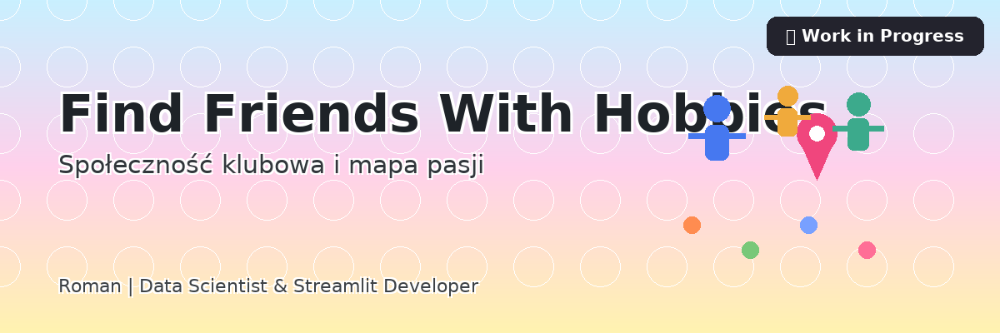

# 🌍 Find Friends With Hobbies  
> *Społeczność klubowa i mapa pasji*

{ .rounded .shadow }

**Autor:** Roman — *Data Scientist & Streamlit Developer*

---

## O projekcie
**Find Friends With Hobbies** to rozbudowana aplikacja społecznościowa zbudowana w Pythonie (Streamlit + SQLite + Folium), która łączy ludzi o wspólnych pasjach. Użytkownicy mogą zakładać konta, dołączać do klubów, pisać na forum i odnajdywać znajomych na mapie.  
Projekt jest w **aktywnej fazie rozwoju** i działa lokalnie, aby usprawnić szybkie iteracje funkcji i UX.

---

## Kluczowe funkcje (stan obecny)
- ✅ Rejestracja i logowanie użytkowników (haszowanie haseł – `hashlib`)
- ✅ Profile, kluby i forum z edycją postów
- ✅ Mapa użytkowników (Folium + MarkerCluster)
- ✅ Integracja z API pogody (`wttr.in`)
- ✅ Logowanie zdarzeń i backup do CSV
- ✅ Panel administratora: użytkownicy/kluby/treści
- ⏳ Rekomendacje klubów (OpenAI) – w trakcie

---

## Tech stack
`Python` · `Streamlit` · `SQLite` · `Folium` · `Pandas` · `Plotly` · `dotenv` · `Logging`

---

## Podgląd
## Podgląd

