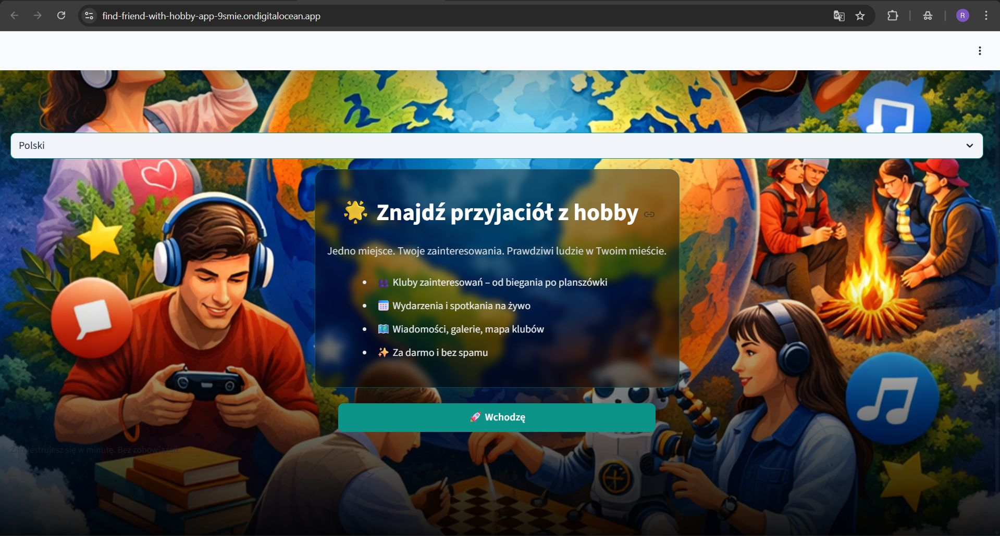
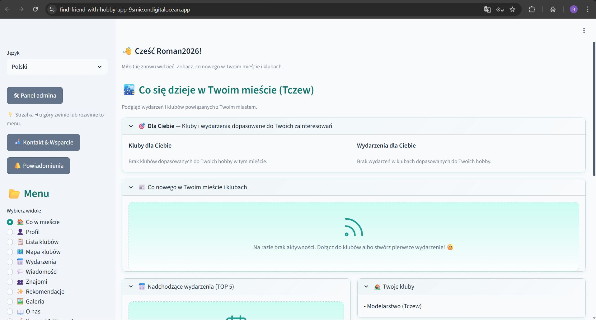
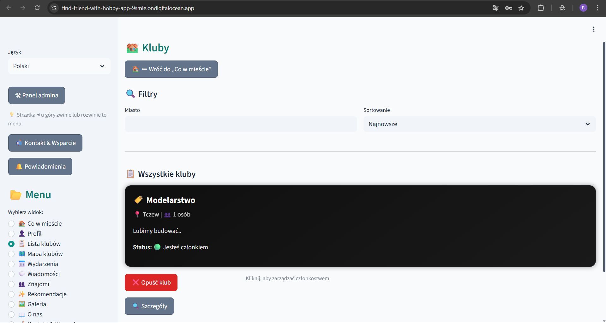
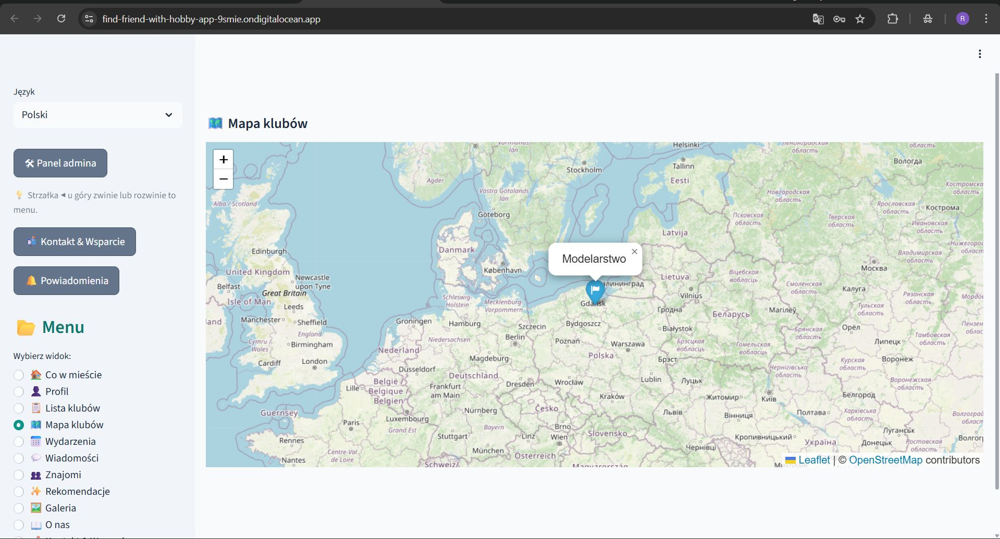

# 🤝 Find Friends With Hobbies — Connect Through Shared Interests

{ width="720" }

> **Find Friends With Hobbies** to aplikacja społecznościowa zbudowana w Pythonie i Streamlit, która pomaga użytkownikom poznawać osoby o podobnych zainteresowaniach.
> Projekt łączy profile użytkowników, kluby, wydarzenia, wiadomości i rekomendacje w jednej aplikacji webowej.
>
> **Find Friends With Hobbies** is a community web app built with Python and Streamlit.
> It helps people connect through shared interests using profiles, clubs, events, messages and recommendations.

---

## 🎯 Cel projektu / Project Goal

Celem projektu jest ułatwienie nawiązywania znajomości wokół wspólnych pasji i aktywności.
Zamiast zwykłej listy użytkowników aplikacja tworzy bardziej społecznościowe środowisko: użytkownicy mogą dołączać do klubów, śledzić wydarzenia, wymieniać wiadomości i odkrywać osoby oraz miejsca dopasowane do ich zainteresowań.

The goal of the project is to make it easier for people to build connections around shared hobbies and activities.
Instead of a simple user directory, the app creates a more community-driven environment with clubs, events, messaging and recommendations.

---

## 🧩 Aktualne funkcje / Current Features

- 👤 Rejestracja, logowanie i zarządzanie kontem
- 🏙️ Dashboard „Co w mieście” / “What’s happening”
- 👥 Profile użytkowników
- 🏛️ Kluby zainteresowań
- 📅 Wydarzenia klubowe
- 💬 Wiadomości prywatne i forum
- 🤝 Znajomi / obserwowanie użytkowników
- 🎯 Rekomendacje użytkowników, klubów i aktywności
- 🗺️ Elementy lokalizacji i mapy
- 🌦️ Integracja lokalizacji i pogody
- 🌍 Obsługa języka polskiego i angielskiego
- 🛠️ Panel admina i funkcje moderacyjne

---

## 🚀 Demo aplikacji / Live Demo

[🌐 Uruchom aplikację / Open live demo](https://find-friend-with-hobby-app-9smie.ondigitalocean.app/){ target=_blank }

> Wdrożenie: **DigitalOcean App Platform**  
> Deployment: **Dockerfile + DigitalOcean App Platform**

---

## 🧱 Architektura / Architecture

Projekt został podzielony na moduły, aby łatwiej go rozwijać i utrzymać.
Centralnym punktem pozostaje aplikacja Streamlit, a logika pomocnicza została rozbita na osobne pliki odpowiedzialne za konfigurację, bazę danych, lokalizację, pogodę, wysyłkę maili i uploady.

The codebase is split into modules to support further development and maintainability.
The Streamlit app remains the entry point, while supporting logic is separated into dedicated files for configuration, database access, geolocation, weather, email and uploads.

### Główne elementy repo / Main Repository Areas

- `app.py` — główny punkt wejścia, router i widoki UI
- `config.py` — konfiguracja środowiska i logowanie
- `db.py` — połączenia z bazą i inicjalizacja schematu
- `geo_weather.py` — geokodowanie i pogoda
- `email_service.py` — obsługa wysyłki e-maili
- `uploads.py` — obsługa plików i galerii
- `admin.py`, `auth.py`, `clubs.py`, `messages.py` — logika poszczególnych obszarów aplikacji
- `scripts/` — skrypty pomocnicze i inicjalizacja środowiska

---

## 🗄️ Dane i backend / Data and Backend

Aplikacja została przygotowana do pracy zarówno z **PostgreSQL**, jak i **SQLite**, co ułatwia testy lokalne i wdrożenie produkcyjne.
Repo i dokumentacja wdrożeniowa pokazują też podejście do trwałego przechowywania kont, klubów, wiadomości i znajomych po stronie bazy danych.

The app supports both **PostgreSQL** and **SQLite**, which makes local testing easier while allowing a production-ready database setup for deployment.

---

## 🧭 Co pokazuje ten projekt / What This Project Demonstrates

Ten projekt pokazuje moje praktyczne umiejętności w zakresie:

- budowy większej aplikacji webowej w Pythonie i Streamlit
- projektowania logiki społecznościowej i funkcji użytkownika
- pracy z bazą danych i wieloma modułami aplikacji
- integracji funkcji lokalizacyjnych i map
- wdrażania aplikacji przez Docker i DigitalOcean
- rozwijania projektu end-to-end — od logiki po interfejs

This project demonstrates my practical skills in:

- building larger Python and Streamlit applications
- designing community-focused product logic
- working with databases and multi-module architecture
- integrating location and map-based features
- deploying apps with Docker and DigitalOcean
- delivering end-to-end projects from backend logic to UI

---

## 🖼️ Główne obszary aplikacji / Main App Areas

## 📸 Podgląd aplikacji / App Preview

### 🏠 Ekran startowy / Landing Page

{ width="720" }

Strona startowa pokazuje główny cel aplikacji: łączenie ludzi o podobnych zainteresowaniach, klubach i aktywnościach.  
To najbardziej reprezentacyjny ekran projektu i dobre wejście dla nowych użytkowników.

---

### 🌆 Dashboard miejski / City Dashboard

{ width="720" }

Dashboard „Co w mieście” pokazuje użytkownikowi najważniejsze informacje związane z jego lokalizacją, klubami i aktywnością w aplikacji.  
To centrum codziennego korzystania z produktu.

---

### 🏛️ Lista klubów / Club List

{ width="720" }

Widok klubów pozwala filtrować społeczności, sprawdzać szczegóły i zarządzać członkostwem.  
To jeden z najważniejszych obszarów aplikacji, bo właśnie tutaj użytkownicy znajdują grupy zgodne ze swoimi hobby.

---

### 🗺️ Mapa klubów / Clubs Map

{ width="720" }

Mapa klubów dodaje lokalny i praktyczny wymiar aplikacji, pokazując społeczności w kontekście geograficznym.  
To funkcja, która wyróżnia projekt i dobrze pokazuje integrację map oraz danych lokalizacyjnych.

---

## 🧮 Technologie / Tech Stack

- **Python**
- **Streamlit**
- **PostgreSQL / SQLite**
- **bcrypt**
- **Folium**
- **Pandas**
- **requests**
- **python-dotenv**
- **streamlit-folium**
- **Pillow**
- **pyotp**
- **qrcode**
- **Docker**
- **DigitalOcean App Platform**

---

## 🔮 Dalszy rozwój / Next Steps

Projekt jest już wdrożony i działa jako aplikacja webowa, ale ma naturalną przestrzeń do dalszego rozwoju, na przykład w kierunku:

- rozbudowy systemu rekomendacji
- lepszego zarządzania wydarzeniami i klubami
- rozwinięcia komunikacji społecznościowej
- dalszej poprawy UX i moderacji
- mocniejszej analityki aktywności użytkowników

---

## 🔗 Linki / Links

- 🌐 [Live demo](https://find-friend-with-hobby-app-9smie.ondigitalocean.app/){ target=_blank }
- 💻 [GitHub repo](https://github.com/Romi-2023/find_friends_with_hobbies){ target=_blank }
- 💼 [LinkedIn](https://www.linkedin.com/in/roman-knopp-90aab3396/){ target=_blank }

---

*Find Friends With Hobbies — bo wspólne pasje łatwiej znaleźć razem 😊*
