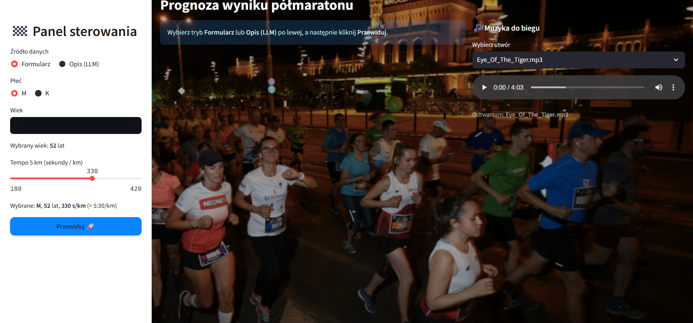

# 🏁 Race Analyzer — Training & Inference Pipeline

> **Zakończony projekt**: rozbudowana aplikacja/pipeline do przetwarzania wyników biegów, trenowania modeli i generowania prognoz.
>
> **Tryb uruchomienia:** lokalny (bez połączenia z DO – dostarczam fallback.

{ .rounded .shadow }

---

## 🎯 Cel projektu
Zbudować stabilny pipeline do:
- łączenia i czyszczenia danych (CSV / API),
- trenowania modelu (automatyczne przygotowanie cech, walidacja),
- przewidywania wyników i tworzenia rankingów,
- pakowania artefaktów (modele + runtime) oraz uruchamiania inference w Streamlit.

---

## 🧩 Najważniejsze funkcje
- 🧹 **ETL**: agregacja wielu CSV, czyszczenie kolumn, walidacja schematu  
- 🧪 **Training**: pipeline w Pythonie (skrypty + notebook), logi i metryki  
- 📦 **Model bundle**: eksport/ładowanie modelu, wersjonowanie artefaktów  
- ⚙️ **Inference UI**: Streamlit „one-click” do przewidywań  
- 🧱 **Fallback danych**: jeśli DO niedostępne → użyjemy lokalnych plików demo  
- 🧾 **CLI**: zadania „prepare / train / upload / run” (skrypty *.py)

---

## 🛠️ Tech stack
`Python` · `Streamlit` · `Pandas` · `scikit-learn` · `Matplotlib/Seaborn` · `SQLite (opcjonalnie)` · `Logging` · `dotenv`

---

## 🧪 Uruchomienie lokalnie

> **Bez konta DO** też zadziała – w trybie demo (dostarczam fallback na plik lokalny).

## Szybki start (DEMO)

  <a class="md-button md-button--primary" href="demo.zip" download>⬇️ Pobierz DEMO (ZIP)</a>
  <a class="md-button" href="demo/run_windows.bat" download>🪄 Uruchom na Windows</a>
  <a class="md-button" href="demo/run_unix.sh" download>🐧 macOS / Linux</a>

## Jak uruchomić DEMO
1. Rozpakuj `demo.zip`.
2. Wejdź do folderu `demo`.
3. Windows: uruchom `run_windows.bat` (More info → Run anyway).
4. macOS/Linux: `chmod +x run_unix.sh && ./run_unix.sh`

