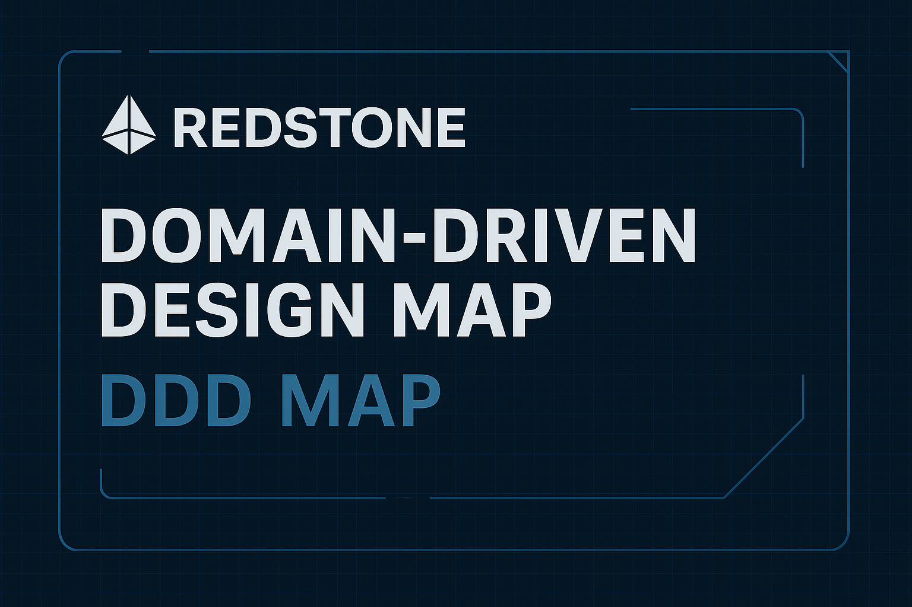

# 🧱 RedStone — Domain-Driven Design Map

## 🎯 Cel projektu
Celem projektu było opracowanie **modelu domenowego** dla firmy **RedStone**, dostawcy modularnego oracla dla blockchainów.  
Analiza oparta została o zasady **Domain-Driven Design (DDD)** i obejmuje pełne mapowanie domen, kontekstów bounded, przepływów zdarzeń oraz KPI.

---

## ⚙️ Zakres i Metody
- **Metodyka:** DDD, Event Storming, Bounded Contexts, RACI  
- **Zakres analizy:** Price Feeds, Proof of Reserve, Atom/OEV, On-chain Publishing  
- **Narzędzia:** Obsidian Canvas, Markdown, PDF, mindmapa PNG  
- **Źródła:** redstone.finance, JustJoinIT, dokumentacja publiczna  

---

## 🧩 Wyniki analizy
- Zidentyfikowano **Core Domain:** „zaufane wyceny on-chain dla smart kontraktów”  
- Zmapowano 8 **Bounded Contexts**, m.in.:
  - Data Ingestion  
  - Aggregation & Pricing  
  - On-chain Publishing  
  - Proof of Reserve  
  - Security & Staking  
  - Client Integrations  
- Opracowano **Event Storming flow** (`TickReceived → TickValidated → PriceDerived → PublishDecisionMade`)  
- Zdefiniowano **Ubiquitous Language:** Feed, Heartbeat, Deviation Threshold, Quorum, Proof of Reserve  
- Utworzono **strukturę RACI** dla ról: CEO, Co-founders (Tech), Head of BD  
- Zdefiniowano zestaw **KPI technicznych i biznesowych**

---

## 📊 Rezultaty
✅ Kompletny model DDD systemu oracle-on-chain  
✅ Zwiększona przejrzystość i spójność języka domenowego  
✅ Analiza gotowa do prezentacji technicznej (rekrutacja, konsultacje, mentoring)

---

## 🧩 Materiały do pobrania
| Typ | Opis | Link |
|-----|------|------|
| 📄 PDF | Pełna dokumentacja DDD | [redstone_ddd_map.pdf](./redstone_ddd_map.pdf) |
| 📝 Markdown | Wersja tekstowa modelu | [redstone_ddd_map.md](./redstone_ddd_map.md) |
| 🗺️ Obraz mapy | Wizualizacja Canvas | [redstone_detail_canvas.png](./redstone_detail_canvas.png) |
| 📜 Instrukcja | Jak otworzyć Canvas w Obsidian | [readme.txt](./readme.txt) |

---

## 🏷️ Tagi
`#DomainDrivenDesign` `#Blockchain` `#DeFi` `#SystemDesign` `#DataScience` `#PortfolioProject`

---

## 💬 Opis skrócony
> Przeprowadziłem analizę domenową RedStone (DeFi oracle) w ujęciu DDD.  
> Opracowałem mapę bounded contexts, event storming, KPI i strukturę RACI dla zespołów technicznych.  
> Efektem jest pełny model systemu — od Data Ingestion po Proof of Reserve — z wizualizacją w Obsidian Canvas i PDF.

---
